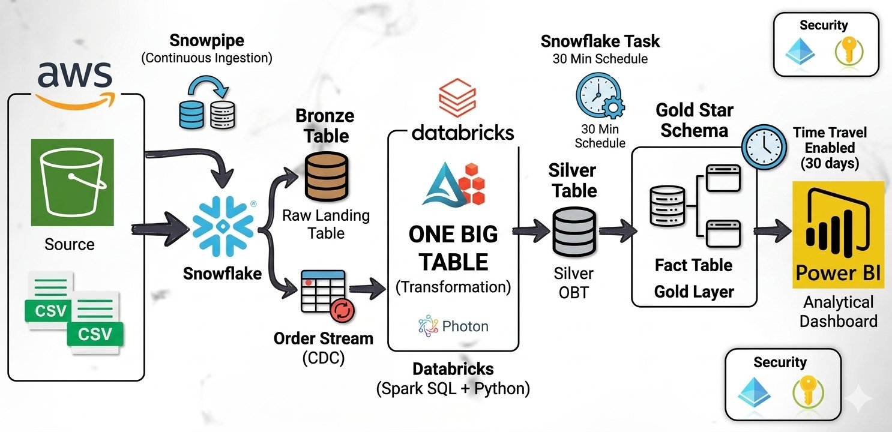

# Indian_Retail_Analytics_AWS_Snowflake_Streams_Tasks_Databricks_Python_Spark_SQL_Power_BI

An enterprise-grade, end-to-end cloud data engineering pipeline implementing a **Medallion (Bronze/Silver/Gold) Architecture**. This system continuously ingests, transforms, models, and visualizes 250,000+ transactional e-commerce records optimized for the Indian retail market.

---

## 🏗️ System Architecture & Data Flow



---

## 🛠️ Tech Stack & Key Concepts Covered
* **Cloud Storage:** **AWS S3** acting as the highly durable raw Data Lake Landing Zone.
* **Data Warehouse:** **Snowflake** managing the centralized Compute & Storage environment.
* **Distributed Compute:** **Databricks (Serverless Python)** utilizing an optimized Pandas translation engine to handle heavy lookup enrichments.
* **Continuous Ingestion:** **Snowpipe** listening natively to AWS SQS queues to load micro-batches instantly.
* **Change Data Capture (CDC):** **Snowflake Streams** tracking row-level append history to minimize downstream cloud compute costs.
* **Orchestration:** **Snowflake Tasks** executing multi-statement SQL procedural transactions on a strict cron schedule.
* **Data Protection & Governance:** **Snowflake Time Travel (30-Day Retention)** for fail-safe auditing, point-in-time querying, and data corruption recovery.
* **Business Intelligence:** **Power BI Desktop** connected via **DirectQuery** to deliver real-time metric rendering.

---

## 📦 Dataset Specifications (Indian E-Commerce Context)
The project processes a relational Indian E-Commerce dataset across three primary entities:
1. **Sales Transactions:** Logs `Order_ID`, `Quantity`, `Unit_Price`, `Payment_Mode` (UPI, COD, Net Banking, Cards), and order delivery markers.
2. **Customer Demographics:** Localized mapping tracking `Customer_Name`, `Gender`, `Customer_Tier`, and geographic location profiles across Indian cities and states (e.g., Uttar Pradesh, Delhi, Tamil Nadu).
3. **Product Catalog:** Stores inventory data containing `Product_Name`, `Category`, and `Brand`.

---

## ⚙️ Detailed Pipeline Implementation Phases

### 1. Ingestion Layer (AWS ➔ Snowpipe ➔ Bronze)
* Configured an **AWS IAM Storage Integration Role** and trust policy handshake to establish secure access to S3 without embedding raw access keys.
* Built modular **Snowpipe Ingestion Engines** optimized using positional mapping metrics (`$1, $2, $3...`) to systematically wrap flat incoming multi-source CSV files into clean, readable JSON `VARIANT` payloads inside Snowflake Bronze tables: `STG_RAW_SALES`, `STG_RAW_CUSTOMERS`, and `STG_RAW_PRODUCTS`.

### 2. Transformation Layer (Bronze ➔ Databricks ➔ Silver)
* Created isolated native **Snowflake CDC Streams** over the Bronze layer to trap incoming modifications.
* Implemented a **Databricks Serverless Pipeline** using Python to securely pull delta rows from the active streams via an optimized `DictCursor` connection.
* Applied strict type conversions, resolved casing/linter structural conflicts, enriched records using multi-table dataframe merges, and bulk-appended the consolidated data back to the Snowflake Silver schema layer as a **One Big Table (`ONE_BIG_TABLE`)**.
* Secured sensitive environment variables by injecting local session runtime context credentials via `dbutils.widgets.text`, eliminating hardcoded production passwords.

### 3. Analytics & Orchestration Layer (Silver ➔ Tasks ➔ Gold Star Schema)
* Modeled an enterprise **Star Schema** in the Gold Layer composed of a transactional fact table (`FACT_SALES`) surrounded by dimensional reference lookup sheets (`DIM_CUSTOMERS` and `DIM_PRODUCTS`).
* Created a scheduled **Snowflake SQL Task** (`sync_gold_star_schema_task`) designed to automatically fire every 30 minutes, handling structural data synchronization through dynamic incremental `MERGE` statement sweeps.
* Activated a **30-day Time Travel retention window** across all Gold tables to ensure enterprise data protection against accidental script drops or processing errors.

### 4. Visualization Layer (Gold ➔ Power BI DirectQuery)
* Connected **Power BI Desktop** directly to the live Snowflake Gold Layer using **DirectQuery** mode to push visual rendering compute back onto Snowflake.
* Designed a semantic star-schema model relationship map linking fact and dimension primary keys.
* Created visualizations tracking **Total Revenue (₹)**, **Digital Payment Adaptation Density (UPI vs. COD)**, and **Geographic Sales Heatmaps** across Indian states.

---

## 📂 Repository File Structure
```text
├── .github/                       # GitHub workflow actions
├── snowflake_pipeline_setup.sql   # Consolidated Gold/Silver/Bronze DDL & Tasks scripts in snowflake
├── indian_retail_transformation_pipeline.ipynb   # Clean Python CDC transformation notebook code in databricks
└── README.md                      # Documentation file
```

---

## 🚀 How to Replicate and Run This Project

1. **Database Script Deployment:** Execute the complete `snowflake_pipeline_setup.sql` script inside your Snowflake worksheet console to initialize databases, pipelines, roles, and schema infrastructure.
2. **AWS Cloud Event Linkage:** Copy the generated SQS ARN string from the Snowflake pipe parameters list and attach it as an active **All Object Created Event Notification** inside your target S3 bucket properties.
3. **Databricks Execution Context:** Open Databricks, link it to your GitHub Repository folder, paste the `indian_retail_transformation_pipeline.ipynb` file, fill out the environment variables widget panel, and run the pipeline!

# 🏛️ India Retail Analysis Dashboard
### 🚀 Enterprise Power BI Implementation (Gold Layer Star Schema Model)

An end-to-end business intelligence solution designed to track, forecast, and optimize commercial operations for a retail network in India. This project translates raw transactional data into high-performance executive analytics by structuring a dedicated **Gold Layer Star Schema**, implementing advanced **Time-Intelligence DAX calculations**, and utilizing professional UX/UI layout patterns.

---

## 🏛️ 1. Data Model Architecture (Star Schema)

The dashboard is powered by a high-performance **Gold Layer Star Schema (1-to-Many `1:*`)** configuration. All dimensions flow down cleanly to filter a central transactional fact table, ensuring optimal report performance and logical consistency.

*   **`FACT_SALES` (Fact Table):** Houses primary transactional headers.
    *   *Schema:* `order_id` (PK), `customer_id` (FK), `product_id` (FK), `order_date` (FK), `quantity`, `unit_price`, `total_amount`, `payment_mode`, `order_status`.
*   **`DIM_CUSTOMERS` (Dimension):** Manages user profile demographics.
    *   *Schema:* `customer_id` (PK), `customer_name`, `gender`, `customer_tier`, `city`, `state`.
*   **`DIM_PRODUCTS` (Dimension):** Contains product catalog details.
    *   *Schema:* `product_id` (PK), `product_name`, `category`, `brand`.
*   **`DIM_DATE` (Calculated Date Table):** An unbroken, sequential calendar dimension critical for time-intelligence consistency.
    *   *Schema:* `Date` (PK), `DateKey`, `Year`, `Month Number`, `Month Name`, `Month-Year` (Sorted via Month-Year Sort), `Month-Year Sort`, `Quarter`.

### 🔄 Model Relationships
*   `DIM_CUSTOMERS[customer_id]` `1 ─── 1:* ─── ➔` `FACT_SALES[customer_id]` (Cross filter: Single)
*   `DIM_PRODUCTS[product_id]` `1 ─── 1:* ─── ➔` `FACT_SALES[product_id]` (Cross filter: Single)
*   `DIM_DATE[Date]` `1 ─── 1:* ─── ➔` `FACT_SALES[order_date]` (Cross filter: Single)

---

## 📈 2. Production-Grade DAX Measures

### Core KPIs
```dax
Total Revenue = SUM(FACT_SALES[total_amount])
// Formatted directly as Currency: English (India) [₹]
```

```dax
Total Orders = DISTINCTCOUNT(FACT_SALES[order_id])
```

```dax
Average Order Value (AOV) = 
DIVIDE(
    [Total Revenue], 
    [Total Orders], 
    0
)
```

### Time-Intelligence & Advanced Sizing Metrics
```dax
Previous Month Revenue = 
CALCULATE(
    [Total Revenue],
    PREVIOUSMONTH('DIM_DATE'[Date])
)
```

```dax
MoM Revenue Growth % = 
DIVIDE(
    [Total Revenue] - [Previous Month Revenue], 
    [Previous Month Revenue], 
    0
)
// Formatted directly as Percentage (%) with explicit decimal visibility to avoid truncation rounding bugs.
```

```dax
YTD Total Revenue = 
TOTALYTD(
    [Total Revenue], 
    'DIM_DATE'[Date]
)
```

```dax
Product Bubble Size Index = 
VAR Growth = [MoM Revenue Growth %]
RETURN
    SWITCH(
        TRUE(),
        ISBLANK(Growth), 2,
        Growth < 0, 1, -- Prevents negative/zero bubble rendering crashes in native scatter charts
        1 + (Growth * 15)
    )
```

### Dynamic Color Routing (Conditional Formatting Engine)
```dax
State Performance Color = 
VAR CurrentStateRevenue = [Total Revenue]
VAR StateRevenueTable = 
    ADDCOLUMNS(
        ALLSELECTED('DIM_CUSTOMERS'[state]), 
        "@StateRev", [Total Revenue]
    )
VAR Percentile75 = PERCENTILEX.INC(StateRevenueTable, [@StateRev], 0.75)
VAR Percentile25 = PERCENTILEX.INC(StateRevenueTable, [@StateRev], 0.25)
RETURN
    SWITCH(
        TRUE(),
        ISBLANK(CurrentStateRevenue), BLANK(),
        CurrentStateRevenue >= Percentile75, "#2ECC71",  -- Vibrant Green (Top 25%)
        CurrentStateRevenue <= Percentile25, "#E74C3C",  -- Alert Red (Bottom 25%)
        "#F39C12"                                        -- Amber (Mid Performers)
    )
```

```dax
Gauge Performance Color = 
VAR Pacing = DIVIDE([YTD Total Revenue], [Annual Revenue Target], 0)
RETURN
    SWITCH(
        TRUE(),
        Pacing >= 0.90, "#2ECC71",  -- Vibrant Green (Met or nearing target)
        Pacing >= 0.60, "#F39C12",  -- Amber (Moderate pacing)
        "#E74C3C"                   -- Alert Red (Critically underperforming)
    )
```

---

## 📊 3. Visualizations & Chart Directory

The dashboard is structured into an intuitive, two-page enterprise layout with seamless UI tracking.

### 📱 Page 1: Executive Overview
Designed for high-level stakeholders to monitor operational pacing, macro-level regional growth, and goal benchmarks.

#### 1. Executive Core KPI Blocks (New Card Visual)
*   **What it Represents:** Tracks overall company performance parameters instantly, providing immediate access to aggregate cash inflow, order count volumes, and velocity rates.
*   **Metrics Featured:** `[Total Revenue]`, `[Total Orders]`, and `[MoM Revenue Growth %]`.
*   **UX Enhancement:** Includes conditional textual color alerts (Green for growth, Red for contraction).

#### 2. India Heatmap Sales Visual (Shape/Azure Map)
*   **What it Represents:** A geographic representation plotting regional revenue density by state across India.
*   **Configuration:** `DIM_CUSTOMERS[state]` maps localized parameters, scaled by `[Total Revenue]`.
*   **UX Enhancement:** Bound to the `[State Performance Color]` DAX script. States dynamically auto-color to **Vibrant Green** if they perform in the country's top 25% percentile bracket, **Amber** for mid-tiers, and **Alert Red** if lagging in the bottom 25% bracket.

#### 3. Operational Performance Speedometer (Gauge Chart)
*   **What it Represents:** Tracks current financial velocity against a dynamically calculated commercial target benchmark, showing how close the sales engine is to hitting target milestones.
*   **Configuration:** Value driven by `[YTD Total Revenue]`, with target thresholds managed by `[Annual Revenue Target]`.
*   **UX Enhancement:** Uses `[Gauge Performance Color]` formatting to dynamically shift the speedometer bar to green the moment execution velocity trends past 90% target pacing.

---

### 🔍 Page 2: Deep-Dive Analytics
Designed for operational managers to cross-examine customer demographics, channel liabilities, and asset distributions.

#### 4. Product Performance Dynamics: Growth-Share Matrix (Scatter Chart)
*   **What it Represents:** A custom variation of a Boston Consulting Group (BCG) portfolio matrix. It categorizes every product in the inventory into strategic management classifications based on market demand and profitability.
*   **Configuration:** 
    *   **X-Axis (Volume):** `[Total Orders]`
    *   **Y-Axis (Value):** `[Total Revenue]`
    *   **Bubble Size:** Scaled using `[Product Bubble Size Index]` to securely map Month-over-Month growth trends.
*   **Dynamic Quadrant Breakdown:**
    *   ⭐ **Stars (Top-Right | Green `#2ECC71`):** High-volume, high-revenue products driving growth.
    *   🐄 **Cash Cows (Top-Left | Blue `#3498DB`):** Low-volume but high-value products providing stable asset margins.
    *   ❓ **Question Marks (Bottom-Right | Orange `#F39C12`):** Fast-moving items with high order counts that need price optimization to yield high revenue.
    *   📉 **Dogs (Bottom-Left | Red `#E74C3C`):** Slow-moving, low-revenue inventory blocks representing capital risk.
*   **UX Enhancement:** Configured with semi-transparent bubble formatting (`40%`) and edge borders so overlapping product dense clusters remain cleanly readable.

#### 5. Order Status Breakdown by Payment Mode (100% Stacked Bar Chart)
*   **What it Represents:** Tracks financial leakage and operational transaction risk across payment categories.
*   **Configuration:** `payment_mode` maps to the Y-Axis, `order_status` feeds the Legend breakouts, and the bar width is calculated via `[Total Orders]`.
*   **Why it Helps:** Normalizing volume channels into absolute 100% blocks allows risk assessment teams to immediately identify if specific payment channels (e.g., Cash on Delivery) suffer from higher return or cancellation percentage distributions compared to UPI or Credit Cards, regardless of scale.

#### 6. Revenue Contribution by Customer Tier & Gender (Treemap Chart)
*   **What it Represents:** Tracks demographic segment spending power to evaluate if loyalty tiers are correctly yielding premium capital.
*   **Configuration:** Group blocks map out `customer_tier` and `gender`, scaled proportionally by `[Total Revenue]`.
*   **UX Enhancement:** Applied a tailored **Premium Tier Palette** to establish visual clarity. **Platinum Tiers** hold a heavy visual block weight using Slate Ice Blue (`#4A6984`), **Gold Tiers** contrast via Satin Gold (`#D4AF37`), and entry-level **Silver Tiers** sit neutrally in Cool Grey (`#E0E4E7`).

#### 7. Monthly Revenue Trends vs. Average Order Value (Combo Chart)
*   **What it Represents:** Evaluates baseline operations velocity. It checks if monthly financial variations are driven by a higher volume of transaction traffic, or by customers purchasing larger, more expensive shopping baskets over time.
*   **Configuration:** Shared X-Axis tracks `DIM_DATE[Month-Year]`. Monthly revenue volumes map as Stacked Columns (`[Total Revenue]`), while basket ticket size scales across the visual layer as a clean trendline indicator (`[Average Order Value (AOV)]`).

---

## 🎨 4. Advanced UX/UI Features

*   **Synchronized Multi-Page Slicers:** The `Month-Year` dropdown slicer is globally synchronized across report layers via the **Sync Slicers** framework. Changing filter conditions on Page 1 seamlessly propagates across Page 2 visuals in the background.

